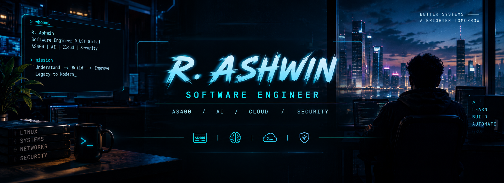

Working on enterprise modernization while exploring AI-assisted development and modern software engineering.

 

### 💼 Currently

| 💼 Work | 🤖 AI | ☁️ Learning | 🔐 Interest |
|:---:|:---:|:---:|:---:|
| AS400 Modernization | Copilot | Google Cloud | Security |
| RPGLE · CL · SQL | Claude Code | Backend | Automation |

 

### 🏢 AS400 → Modernization

`AS400/IBM i` → `RPGLE/CL/SQL` → `Business Logic` → `Documentation` → `Modernization`

Reading legacy enterprise programs and translating existing business logic into documentation for modernization.

### 🤖 AI-Assisted Development

`Legacy Code/Task` → `AI Assist (Copilot/Claude)` → `Review` → `Test` → `Ship`

  

Using AI to speed up development and exploration, with human review always in the loop.

 

### ⚙️ Tech Stack

<table>
<tr><td><b>Engineering</b></td><td>Java · Python · JavaScript/TypeScript · Rust · SQL</td></tr>
<tr><td><b>Enterprise</b></td><td>RPGLE · CL · DB2 for i</td></tr>
<tr><td><b>Frontend/Mobile</b></td><td>React · React Native · HTML/CSS</td></tr>
<tr><td><b>Cloud & Tools</b></td><td>Google Cloud · Git · Linux</td></tr>
<tr><td><b>AI</b></td><td>GitHub Copilot · Claude · Claude Code</td></tr>
<tr><td><b>Security</b></td><td>Linux · Networking · Web Security</td></tr>
</table>

 

### 🚀 Featured Builds

<table>
<tr>
<td width="50%" valign="top">

**🖐️ Gesture Desktop**
Real-time hand-gesture mouse control for Ubuntu.
`Python` `OpenCV` `MediaPipe`
[repo →](https://github.com/ashwin417/gesture-desktop)

</td>
<td width="50%" valign="top">

**🎓 Study Terminal**
Self-built terminal-style exam-prep app.
`HTML` `CSS` `JS`
[repo →](https://github.com/ashwin417/ccdvf-prep)

</td>
</tr>
<tr>
<td width="50%" valign="top">

**📱 LifeOS**
Habit & health tracker with step tracking and charts.
`React Native` `TypeScript` `SQLite`
[repo →](https://github.com/ashwin417/LifeOS)

</td>
<td width="50%" valign="top">

**📓 AS400 Notes**
Public RPGLE/CL/SQL notes from learning IBM i.
`RPGLE` `CL` `SQL`
[repo →](https://github.com/ashwin417/as400_myNotes)

</td>
</tr>
</table>

 

### 🧪 Lab / Experiments

   

Prototypes and things I'm currently trying to break — preferably before production does.

[Gamecraft](https://github.com/ashwin417/Gamecraft) · [rash](https://github.com/ashwin417/rash) · [ash_murmur](https://github.com/ashwin417/ash_murmur) (early, not working yet)

 

### 📌 Experience

| Period | Role |
|---|---|
| 2024 – Present | Developer 1 — Software Engineering, UST Global |
| 2020 – 2024 | BTech CSE — College of Engineering Chengannur |

### 🏅 Certification

Google Cloud Digital Leader

### 📚 Currently Exploring

    

 

### 📊 Stats

 

### 🔗 Connect

[💼 LinkedIn](https://www.linkedin.com/in/ashu-r7/) &nbsp;·&nbsp; [🐙 GitHub](https://github.com/ashwin417) &nbsp;·&nbsp; [🐦 X](https://twitter.com/ashwin_r7)

<code>LEARN / BUILD / AUTOMATE / GROW</code>

